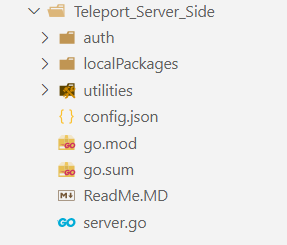

# Teleport Service Overview

## suggest to read the report its better

Teleport is a service developed using the Go programming language, chosen for its high efficiency in managing concurrent connections and superior performance. This makes it an ideal choice for building applications that need to handle large numbers of users with high traffic volumes.

The service comprises several core components, including a central server for managing connections and sessions, an authentication system to ensure data security, and a mechanism for assigning subdomains to each client. The data flow is regulated according to subscription limits through rate limiters, with effective management of active sessions to ensure service continuity securely and efficiently.

## Implementation Details

The service's implementation follows a folder structure designed to closely adhere to clean architecture principles, as illustrated in Figure 1.7.(suggest to read the report its better for you )

The project is functionally divided into the following folders:

- **`auth`**: Contains the authentication logic and communication with the backend server. The main file, `server.go`, implements the necessary functions.
- **`localPackages`**: Houses Go packages specific to the application, developed in-house rather than being part of Go’s standard libraries.
  - **`codec`**: Contains the logic for encoding and decoding, operating at the Application Layer to convert raw data into transmittable formats.
  - **`go-vhost, mux`**: Provides tools for implementing virtual hosting for various protocols like HTTP and TLS. It offers both high-level and low-level interfaces. The high-level interface allows developers to easily manage virtual hosting by wrapping `net.Listener` objects, enabling precise request routing based on the hostname. The low-level interface, on the other hand, offers more direct control over extracting and handling protocol-specific information like the hostname.
  - **`session, transport`**: Manages user sessions and data transport between endpoints.

Connections received via TCP are converted into an HTTP listener, enabling the system to handle requests through the HTTP protocol. The HTTP server runs in a lightweight, parallel processing thread (`goroutine`), allowing for concurrent request handling. The function responsible for serving HTTP requests is called `ConnectionManager`.

Within the `ConnectionManager` function's thread, sequential tasks are performed, including user authentication using the `SignInAndGetSubscriptionType` function found in `auth.go`.

, Go's error handling is straightforward: every function, by default, returns an error if one occurs, making it easy to capture and manage errors,

After the user’s identity is verified, the process of enabling the user to share their local environment online begins. A unique link is generated using the `NewSubdomain` function from the `utilities` package. This link is sent to the developer via an HTTP request that also includes the initial values required to apply the Diffie-Hellman algorithm. This secure key exchange process allows for the establishment of a shared key. Notably, there are no built-in libraries in Go for implementing the Diffie-Hellman algorithm, so it was implemented using HTTP , reducing the number of requests needed to reach an agreement.
